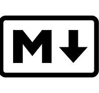

# My Awesome Project ❤️ 



##Dies ist ein beispiel für eine README-Datei in Markdown.Hier kannst du Informationen über dein Projekt, die Installation und die Nutzung bereitstellen.

# Installation   🔥

```sh
git clone https://github.com/username/my-awesome-project.git
cd my-awesome-project
npm install
```
## Nutzung ✅

```sh
npm start
```

### Funktionen 🎉
- Einfache Installation
- Schönes UI
- Schnelle Performance

## Mitwirkende ✨
- [@username](https:/github.com/username)

##Lizenz
Dieses Projekt ist unter der MIT-Lizens lizensiert.

$${\color{red}Red}$$

$${\color{green}Green}$$
